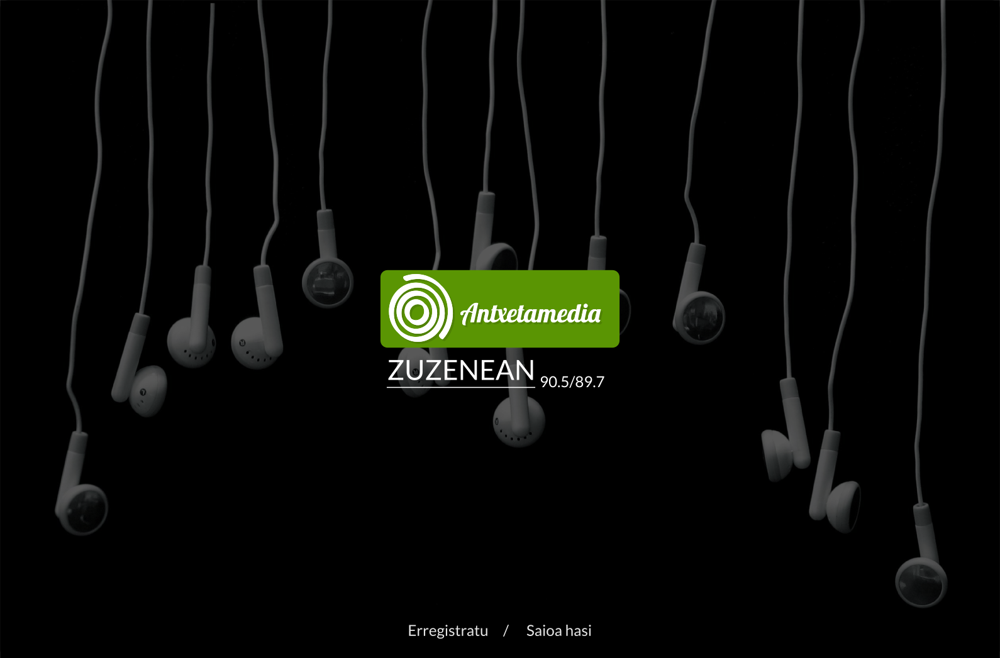
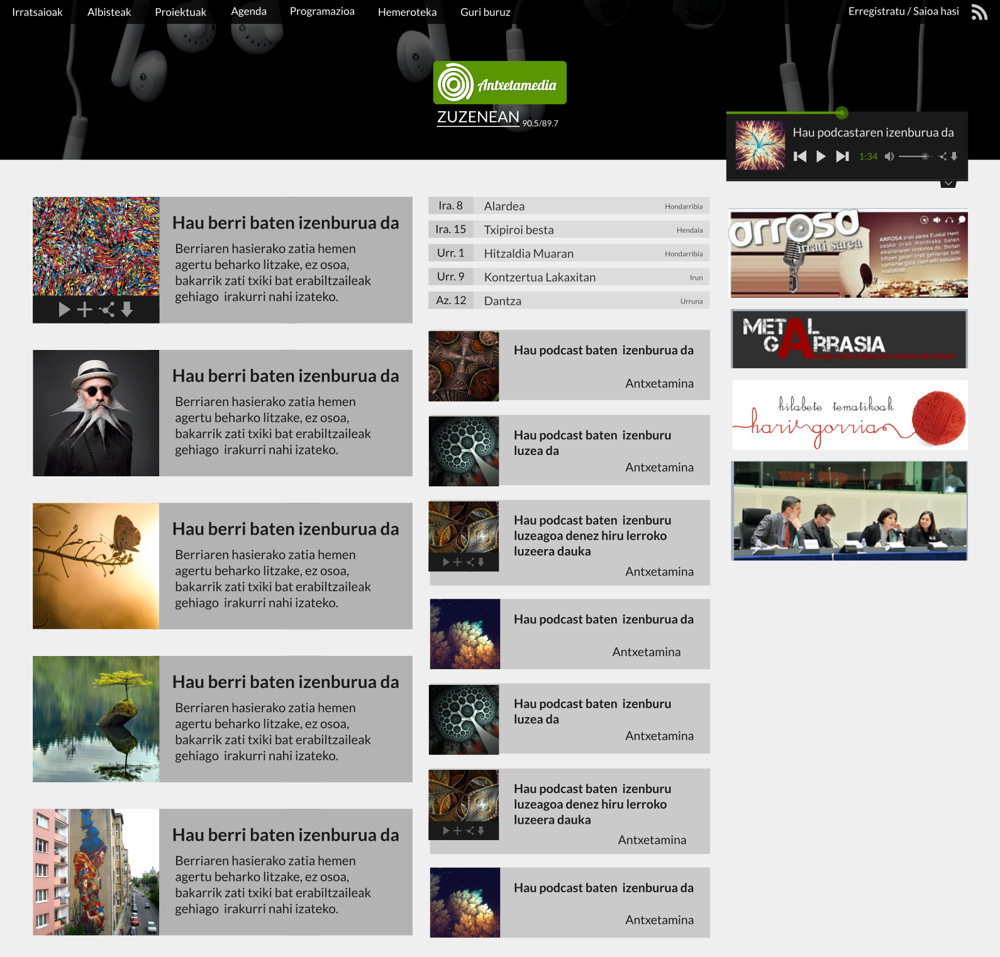
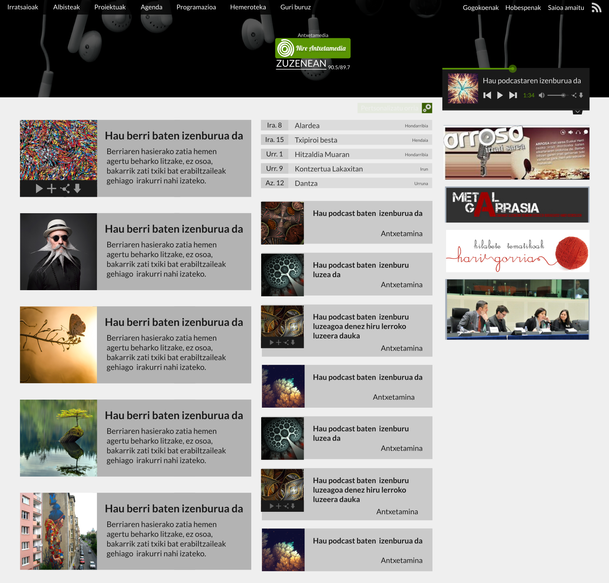
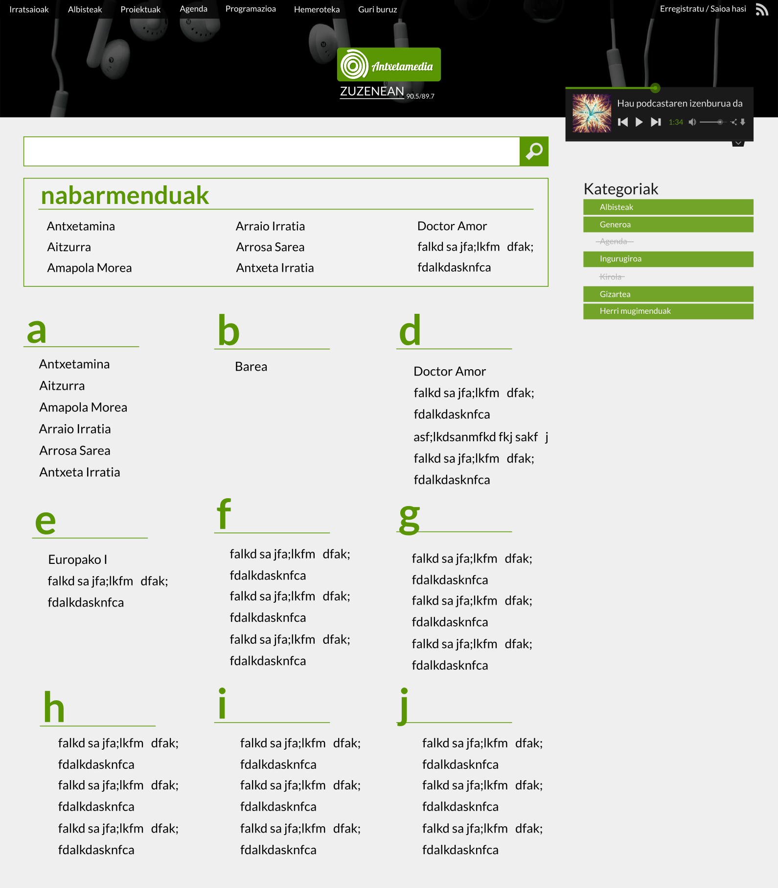
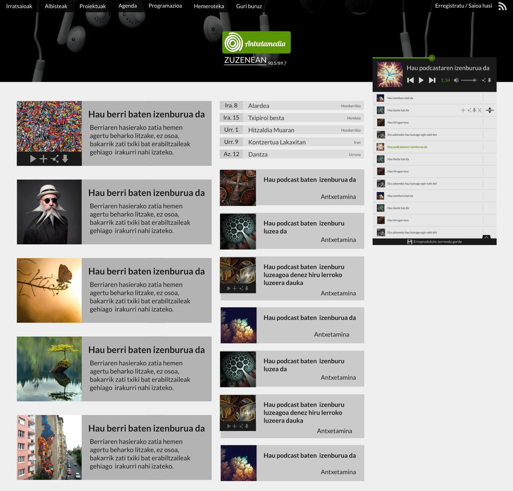
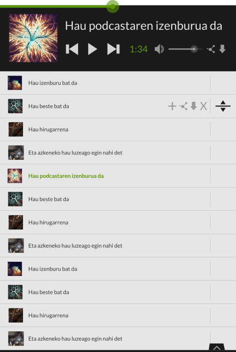

=============================
Antxetamedia.info: aurkezpena
=============================

Antxetamediako webgune berriak aurreko webgunearen atal berdinak mantenduko
ditu:

- Azala
- Albisteak
- Irratsaioak
- Proiektuak
- Agenda
- Programazioa
- Hemeroteka
- Orri lauak (Guri buruz)

Aldaketak beraz atal bakoitzaren barruan emango dira, nabarmenenak azalean,
albistetan, irratsaioetan, proiektuetan eta hemerotekan emanik.

Diseinu garbiagoa eta eguneratuagoa edukitzeaz gain, erabiltzaileen nabigazioa
hobetzeko asmoz, webgunetik mugitzeko modua aldatu egingo da guztiz.

Haien harteko antzekotasuna dela eta, albisteen, irratsaioen eta proiektuen
atalak bat egingo dira "irratia" deituko diogun atalean.

Ongietorria
===========

Erabiltzaile bat gunera lehenengo aldiz sartzean, pantaila osora zabaldutako
ongietorri orri bat ikusiko du. Bertan, Antxetamediaren azalerako logoa,
zuzenean entzuteko aukera eta erregistratu edo saioa hasteko aukera emango
dizkioten estekak edukiko ditu.

Erabiltzailea jada saioa hasita badu edo gunera aurretik sartu dela detektatzen
bada ez da ongietorri orririk azalduko eta zuzenean azalera bidaliko zaio.

Azala
=====

Azalean lau multzo ikusi ahal izango ditugu:

- ezkerreko zutabe nagusian, albisteak.
- erdiko zutabearen goialdean, agendako gertakariak.
- erdiko zutabearen behealdean, irratsaioak.
- eskubiko zutabean, widgetak.

Bai albisteak eta bai irratsaioak dataren arabera agertuko dira, azkenekoak
lehen.

Gertakariak ere dataren arabera agertuko dira. Bakarrik etorkizuneko gertakariak
azalduko dira, lehen datorrena lehen.

Widgetak kudeaketa gunetik sortu ahalko dira HTML pertsonalizatua txertatzeko.
Widget hauek nahi den eran ordenatu ahalko dira.

Erabiltzailea erregistratua badago, albiste eta irratsaio hauek zer albistegi
eta programetatik hartuko diren aukeratu ahalko dezake eta "Nire Antxetamedia"
sortuko du.

Erabiltzaile erregistratuek ere azal estandarrera itzuli ahalko dute logoaren
ondoan dagoen botoia sakatuz.

Irrati atala
============

Irrati aplikazioa gaur egungo webgunearen albiste, irratsaio eta proiektuen
atalak bilduko ditu. Aplikazio hau izango da webgunearen aplikazio nagusia eta
bertan emango da logika gehiena.

Terminologia
------------

Hemendik aurrera, irratsioei (*antxetamina* esaterako), albistegiei (*kale
kantoian* esaterako eta proiektuei (*jeunesse en action* esaterako) **show**
deituko diegu.

Irratsio baten saio bati (*antxetamina*-ko saio bati esaterako), albiste bati
(*kale kantoian*-ek sortutako berri bati esaterako) eta proiektu baten audioari
(*jeunesse en action*-ek argitaratutako saio bati esaterako) **podcast** deituko
diegu.

Honen arrazoia webgunean atal ezberdinak edukiko dituzten arren, haien
funtzionalitatea berdin berdina izango dela da.

Egitura
-------

*Show* guztiek (bai albistegiek, bai irratsaioek eta bai proiektuek, denek)
ezaugarri berdinak edukiko dituzte: izena, deskribapena (estekak, irudiak eta
bideoak sartzeko ahalmenarekin), irudi esanguratsu bat, barneratzen duen
kategoria eta erlazionaturiko hitz klabeak. Azkenik, irratsaioen nabigatzailean
nabarmendua bezala markatzeko aukera izango dute.

Albistegi, irratsaio eta proiektu hauetako bakoitzak bere audio edo podcastak
ditu. Podcast horietako bakoitzak bere izenburua, deskribapena (estekak, irudiak
eta bideoak sartzeko ahalmenarekin), irudi esanguratsu bat, audioaren lizentzia
eta podcastaren audioa bera edukiko du.

Nabigazioa
----------

Irratsaioek nabigatzaile berezia izango dute. Bertan bilaketa kaxa bat egongo
da, idazten den ahala irratsaioak filtratuko dituena. Eskubian kategorien
zerrenda agertuko da eta bertako kategoriak aktibatuz edo desaktibatuz,
irratsaioak ere filtratu egingo dira.

Erdian eta goian, kudeatzailetik nabarmenduak izan diren irratsaioak agertuko
dira. Haien azpian, bilaketaren emaitzak diren irratsaioak agertuko dira
alfabetikoki ordenatuta.

Erreproduktorea
---------------

Erabiltzaileek show bakoitzeko hiru aukera izango dituzte:

- showaren podcast guztiak entzun.
- showaren podcast guztiak erreprodukzio zerrenda batera gehitu:
  - momentuan entzuten ari den zerrendara (baten bat entzuten ari bada).
  - bere podcast gogokoen zerrendara (erregistratua badago).
  - gordeta dituen beste zerrendetako batera (erregistratua badago).
- showaren podcast guztiak jaitsi.

Erabiltzaileek podcast bakoitzeko lau aukera izango dituzte:

- podcasta erreproduzitu.
- podcasta erreprodukzio zerrenda batera gehitu:
  - momentuan entzuten ari den zerrendara (baten bat entzuten ari bada).
  - bere podcast gogokoen zerrendara (erregistratua badago).
  - gordeta dituen beste zerrendetako batera (erregistratua badago).
- podcastaren partekatze kodea kopiatu
- podcasta jaitsi.

Erreprodukzio zerrenda hauek erabiltzaile guztiek edukiko dituzte, bai anonimoak
eta bai gunean erregistratu direnak. Erreprodukzio zerrenda honek erabiltzaileei
aukera eta kontrol ezberdinak emango dizkie:

- zerrendako podcast bat entzutera pasa.
- zerrendako podcast baten embed kodea kopiatu.
- zerrendako podcast bat jaitsi.
- zerrendako podcast bat ezabatu.
- zerrendako podcast bat erreprodukzio zerrenda batean gorde.
- zerrendako podcast bat mugitu.
- zerrenda erreproduzitu.
- zerrenda pausatu.
- zerrendako podcast guztiak jaitsi.
- zerrenda gorde (erabiltzailea erregistratua badago).

Erreprodukzio zerrendak
-----------------------

Erabiltzaile erregistratuek beraien erreprodukzio zerrendak gorde ahal izango
dituzte. Horrela, menu nagagusian esteka bat edukiko dute non haien
erreprodukzio zerrenda guztiak ikusi ahalko dituzten. Horiek entzun, jaitsi,
partekatu edota ezabatu ahal izango dituzte.

HTTP REST APIa
--------------

Aplikazio honek nabigatzaileei alde batetik datu gordinak eta bestetik datu
horiek kudeatzeko logika bidaliko die. Horrela, nabigatzailearen aldeko logika
behin bakarrik bidalia izango da nahiz eta eskaera ezberdinak gauzatu. Horrek
nabigatzeko garaian abiadura azkarragoa edukitzea eta aurrerantzean beste
aplikazio motak (mugikorretarako esaterako) egiteko erraztasun handiagoa izateak
ekarriko du.

Archive.org-ekin sinkronizazioa
-------------------------------

Audio fitxategiak kudeaketa gunetik igoko dira zerbitzarira. Ondoren, modu
asinkronoan, zerbitzariak datuak automatikoki archive.org-era igoko ditu.
Kudeaketa gunean archive.org-erako igoera guztiak eta haien egoerak ikusi ahalko
dira.

Agenda
======

Agendak gaur egungo ezaugarri berdinak mantenduko ditu, aldaketa bakarra
gertakarien daten definiziotan emango delarik. Data hauek errekurtsiboak izan
ahal izango dira (egunero, astero, hilabetero edota urtero ematen diren datak
definitu ahalko direlarik).

Diseinuan aldaketa nabarmenak emango dira.

Programazioa
============

Programazio taulak gaur egungo ezaugarriak mantenduko ditu ematen diren
aldaketak diseinu aldaketak izanik.

Hemeroteka
==========

Guneak atalen arteko nabigazioa errazteko asmoa duen harren, beti egongo dira
erabilera kasuak non erabiltzaileak gunearen funtzionalitatearekin bat ez
datorren kontsultaren bat egin nahi duen.

Adibidez:
- zeintzuk dira *jaion*-ekin zerikusia duten irratsaioak?
- albiste egon ziren urtarrilaren 6an?

Galdera hauei aurre egiteko hemeroteka egongo da.

Bilatzailea
-----------

Bilatzaile orokorrak bakarrik testua bilatu ahal izango du. Sartutako testua
ordea webgunearen atal guztietan zehar bilatuko du.

Albisteak
---------

Albisteen bilatzaileak, testu soila bilatzeaz gain, beste eremuak kontutan
hartuta ere bilatu ahal izango du (datak eta tagak esaterako).

Irratsaioak
-----------

Irratsaioen bilatzaileak, testu soila bilatzeaz gain, beste eremuak kontutan
hartuta ere bilatu ahal izango du (datak eta tagak esaterako).

Gertakariak
-----------

Gertakarien bilatzaileak, testu soila bilatzeaz gain, beste eremuak kontutan
hartuta ere bilatu ahal izango du (datak eta lekuak esaterako).

Orri estatikoak
===============

Orri estatikoak nahi diren haina sortu daitezke. Menuan bakarrik "Guri buruz"
orria agertuko den arren, besteetara zuzenean URLaren bidez sartu ahalko da.
Demagun zozketa bat antolatzen dela. Orri estatiko bat sortu daiteke zozketari
buruzko informazioa emateko eta "/zozketa" URLan eseki. Modu horretan,
"https://antxetamedia.info/zozketa" URLra sartuta, erabiltzaileek orria ikusi
ahal izango dute.

Orri estatiko hauek irudiak, estekak eta embed kodeak txertatzeko aukera emango
dute.
