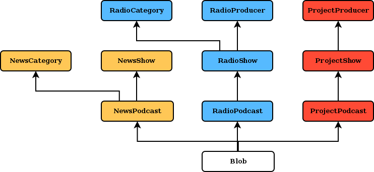

## Layout

### News

Each podcast has a category and a producer.

### Radio

Each podcast has a show. Each show has a category and a producer.

### Projects

Each podcast has a project. Each project has a producer.

### Blobs

Each blob has a GFK to a podcast.

### Events

### Archives

### Schedule

### Flat pages

### Widgets

## Design decisions

### No nested categories

They do not use them currently.

- NewsShows do not need to be categorized.
- RadioShows can be categorized in RadioCategories and RadioProducers.
- ProjectShows can be categorized in ProjectProducers.

### No embeded multimedia models

If they want to use some external embed code, they can use the description text.

### Multiple audios per podcast

They use this feature nowadays. It's true that it makes it somewhat more
difficult to manage the playlist buttons but this can be solved by:

- making the add button add all the audios of the podcast to the playlist.
- making the play button play all the adios of the podcast.
- making the share button share the podcast link.

### Only RadioShows have the "featured" boolean

## User views

- frontpage
- frontpage configuration
- news
    - newspodcast_list: filtered by NewsShow and NewsCategory
    - newspodcast_detail
- radio
    - radioshow_list: filtered by RadioProducer and RadioCategory
    - radiopodcast_list
    - radiopodcast_detail
- projects
    - projectproducer_list
    - projectshow_detail
- archive
- events
    - event_list
    - event_detail
- schedule
    - broadcast_list
