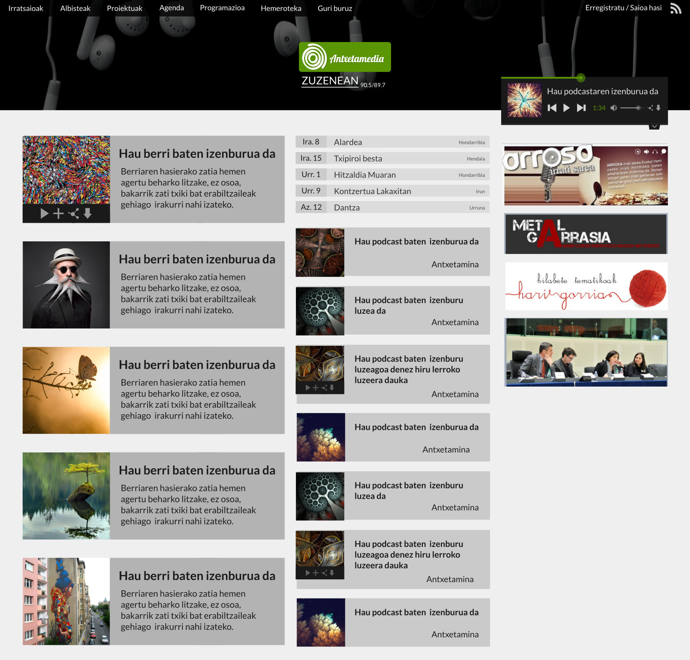
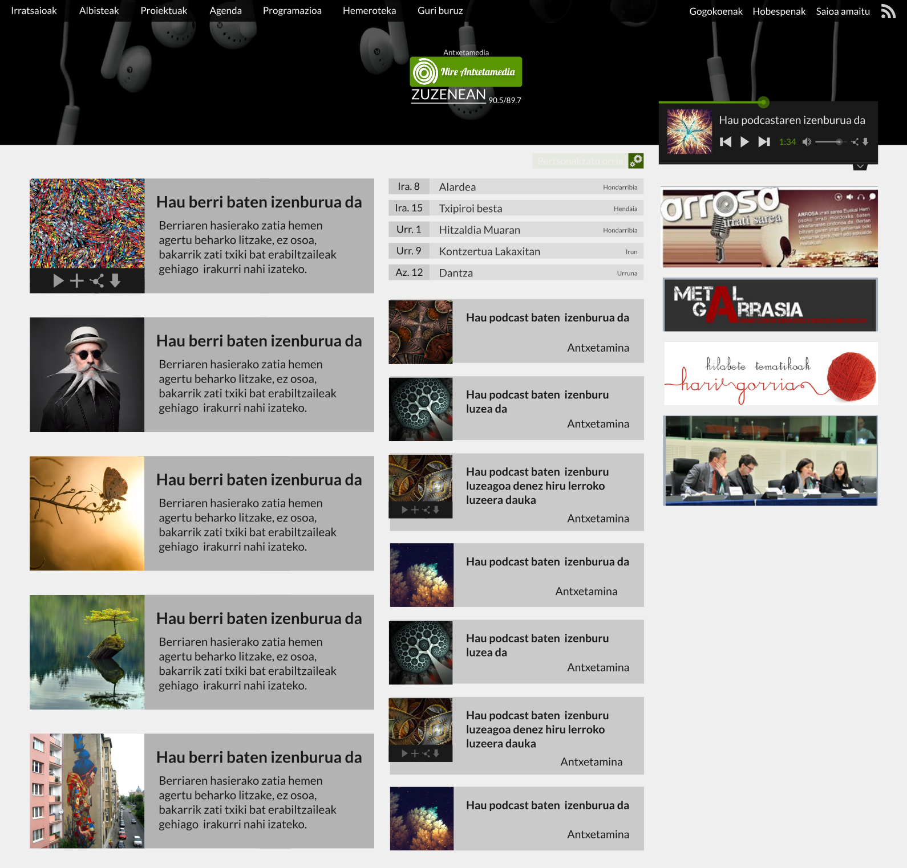
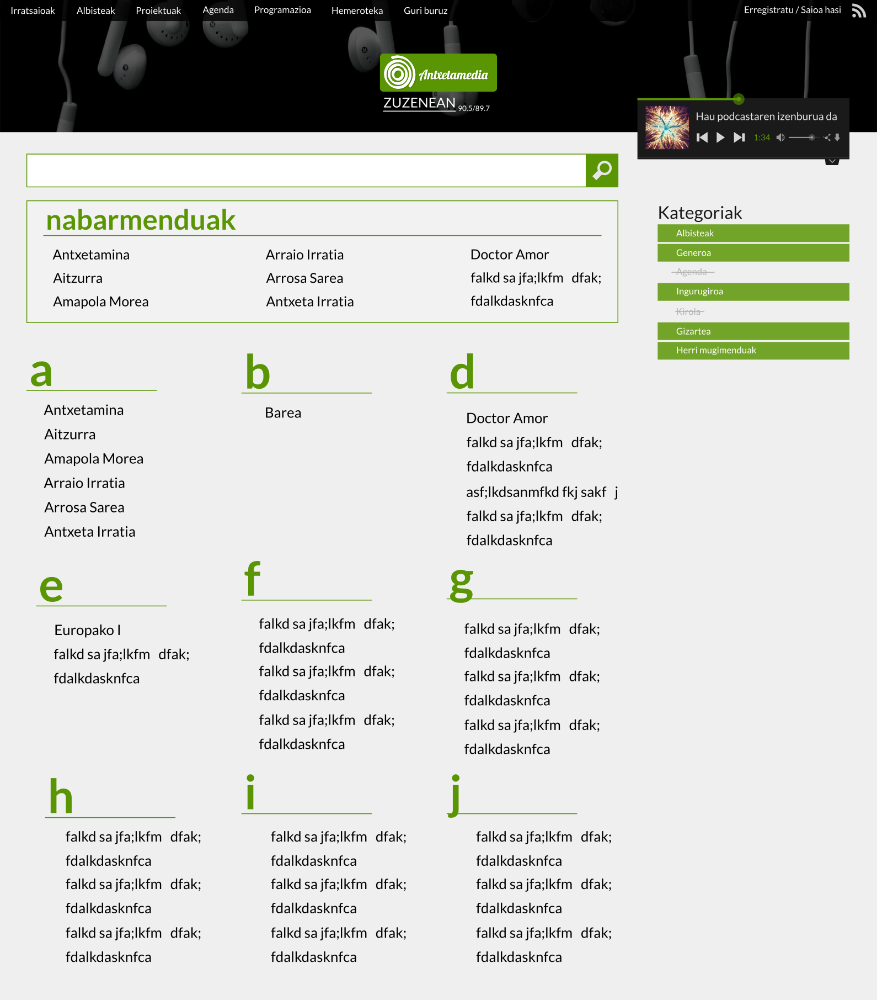
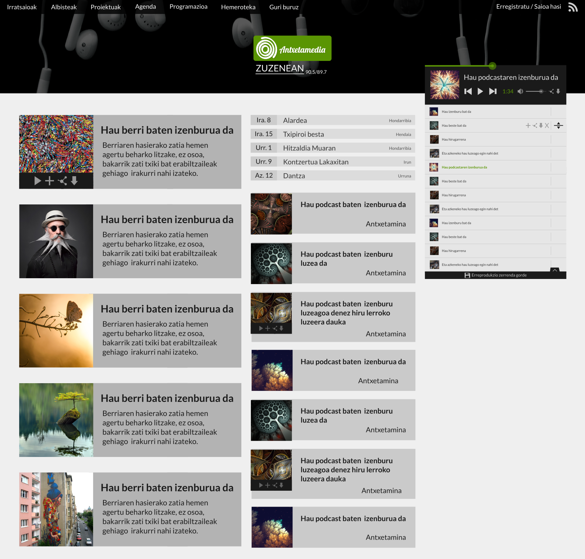
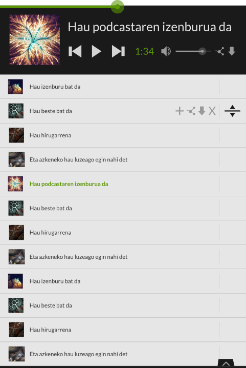

=============================
Antxetamedia.info: aurkezpena
=============================

Antxetamediako webgune berriak aurreko webgunearen atal berdinak mantenduko
ditu:

- Azala
- Albisteak
- Irratsaioak
- Proiektuak
- Agenda
- Programazioa
- Hemeroteka
- Orri lauak (Guri buruz)

Aldaketak beraz atal bakoitzaren barruan emango dira, nabarmenenak azalean,
albistetan, irratsaioetan, proiektuetan eta hemerotekan emanik.

Diseinu garbiagoa eta eguneratuagoa edukitzeaz gain, erabiltzaileen nabigazioa
hobetzeko asmoz, webgunetik mugitzeko modua aldatu egingo da guztiz eta pantaila
konfigurazio ezberdinetara zuzendutako diseinua (*responsive design*) garatuko
da.

Haien arteko antzekotasuna dela eta, albisteen, irratsaioen eta proiektuen
atalak bat egingo dira "irratia" deituko diogun atalean.

Azala
=====

Azalean lau multzo ikusi ahal ditzazkegu:

- ezkerreko zutabe nagusian, albisteak.
- erdiko zutabearen goialdean, agendako gertakariak.
- erdiko zutabearen behealdean, irratsaioak.
- eskubiko zutabean, widgetak.

Bai albisteak eta bai irratsaioak dataren arabera agertuko dira, azkenekoak
lehen.

Gertakariak ere dataren arabera agertuko dira. Bakarrik etorkizuneko gertakariak
azalduko dira, lehen datorrena lehen.

Widgetak kudeaketa gunetik sortu ahalko dira HTML pertsonalizatua txertatzeko.
Widget hauek nahi den eran ordenatu ahalko dira.

Erabiltzaileek, nahiz eta erregistratua ez egon, albiste eta irratsaio hauek zer
albistegi eta programetatik hartuko diren aukeratu ahalko dezake.

Erabiltzaileek haien aukeraketa deuzestu eta azal estandarrera bueltatu
daitezke:

.. image:: sketches/azala_erabiltzailea.png
   :width: 100%

Irratia
=======

Irrati aplikazioa gaur egungo webgunearen albiste, irratsaio eta proiektuen
atalak bilduko ditu. Aplikazio hau izango da webgunearen aplikazio nagusia eta
bertan emango da logika gehiena.

Terminologia
------------

Hemendik aurrera, irratsioei (*antxetamina* esaterako), albistegiei (*kale
kantoian* esaterako eta proiektuei (*jeunesse en action* esaterako) **show**
deituko diegu.

Irratsio baten saio bati (*antxetamina*-ko saio bati esaterako), albiste bati
(*kale kantoian*-ek sortutako berri bati esaterako) eta proiektu baten audioari
(*jeunesse en action*-ek argitaratutako saio bati esaterako) **podcast** deituko
diegu.

Honen arrazoia webgunean atal ezberdinak edukiko dituzten arren, haien
funtzionalitatea berdin berdina izango dela da.

Egitura
-------

*Show* guztiek (bai albistegiek, bai irratsaioek eta bai proiektuek, denek)
ezaugarri berdinak edukiko dituzte: izena, deskribapena (estekak, irudiak eta
bideoak sartzeko ahalmenarekin), irudi esanguratsu bat, barneratzen duen
kategoria eta erlazionaturiko hitz klabeak. Azkenik, irratsaioen nabigatzailean
nabarmendua bezala markatzeko aukera izango dute.

Albistegi, irratsaio eta proiektu hauetako bakoitzak bere audio edo podcastak
ditu. Podcast horietako bakoitzak bere izenburua, deskribapena (estekak, irudiak
eta bideoak sartzeko ahalmenarekin), irudi esanguratsu bat, audioaren lizentzia
eta podcastaren audioa bera edukiko du.

Nabigazioa
----------

Irratsaioek nabigatzaile berezia izango dute. Bertan bilaketa kaxa bat egongo
da, idazten den ahala irratsaioak filtratuko dituena. Eskubian kategorien
zerrenda agertuko da eta bertako kategoriak aktibatuz edo desaktibatuz,
irratsaioak ere filtratu egingo dira.

Erdian eta goian, kudeatzailetik nabarmenduak izan diren irratsaioak agertuko
dira. Haien azpian, bilaketaren emaitzak diren irratsaioak agertuko dira
alfabetikoki ordenatuta.

Erreproduktorea
---------------

Erabiltzaileek podcast bakoitzeko lau aukera izango dituzte:

- podcasta erreproduzitu.
- podcasta erreprodukzio zerrendara gehitu.
- podcastaren partekatze kodea kopiatu
- podcasta jaitsi.

Erreprodukzio zerrenda hauek erabiltzaile guztiek edukiko dituzte, bai anonimoak
eta bai gunean erregistratu direnak. Erreprodukzio zerrenda honek erabiltzaileei
aukera eta kontrol ezberdinak emango dizkie:

- zerrendako podcast bat entzutera pasa.
- zerrendako podcast baten helbidea kopiatu.
- zerrendako podcast bat jaitsi.
- zerrendako podcast bat ezabatu.
- zerrendako podcast bat erreprodukzio zerrendan gorde.
- zerrendako podcast bat mugitu.
- zerrenda erreproduzitu.
- zerrenda pausatu.

Archive.org-ekin sinkronizazioa
-------------------------------

Audio fitxategiak kudeaketa gunetik igoko dira zerbitzarira. Ondoren, modu
asinkronoan, zerbitzariak datuak automatikoki archive.org-era igoko ditu.
Kudeaketa gunean archive.org-erako igoera guztiak eta haien egoerak ikusi ahalko
dira.

Agenda
======

Agendak gaur egungo ezaugarri berdinak mantenduko ditu, aldaketa bakarra
gertakarien daten definiziotan emango delarik. Data hauek errekurtsiboak izan
ahal izango dira (egunero, astero, hilabetero edota urtero ematen diren datak
definitu ahalko direlarik).

Diseinuan aldaketa nabarmenak emango dira.

Programazioa
============

Programazio taulak gaur egungo ezaugarriak mantenduko ditu ematen diren
aldaketak diseinu aldaketak izanik.

Hemeroteka
==========

Guneak atalen arteko nabigazioa errazteko asmoa duen harren, beti egongo dira
erabilera kasuak non erabiltzaileak gunearen funtzionalitatearekin bat ez
datorren kontsultaren bat egin nahi duen.

Adibidez:
- zeintzuk dira *jaion*-ekin zerikusia duten irratsaioak?
- albiste egon ziren urtarrilaren 6an?

Galdera hauei aurre egiteko hemeroteka egongo da.

Bilatzailea
-----------

Bilatzaile orokorrak bakarrik testua bilatu ahal izango du. Sartutako testua
ordea webgunearen atal guztietan zehar bilatuko du.

Albisteak
---------

Albisteen bilatzaileak, testu soila bilatzeaz gain, beste eremuak kontutan
hartuta ere bilatu ahal izango du (datak eta tagak esaterako).

Irratsaioak
-----------

Irratsaioen bilatzaileak, testu soila bilatzeaz gain, beste eremuak kontutan
hartuta ere bilatu ahal izango du (datak eta tagak esaterako).

Gertakariak
-----------

Gertakarien bilatzaileak, testu soila bilatzeaz gain, beste eremuak kontutan
hartuta ere bilatu ahal izango du (datak eta lekuak esaterako).

Orri estatikoak
===============

Orri estatikoak nahi diren haina sortu daitezke. Menuan bakarrik "Guri buruz"
orria agertuko den arren, besteetara zuzenean URLaren bidez sartu ahalko da.
Demagun zozketa bat antolatzen dela. Orri estatiko bat sortu daiteke zozketari
buruzko informazioa emateko eta "/zozketa" URLan eseki. Modu horretan,
"https://antxetamedia.info/zozketa" URLra sartuta, erabiltzaileek orria ikusi
ahal izango dute.

Orri estatiko hauek irudiak, estekak eta embed kodeak txertatzeko aukera emango
dute.

Diseinua
========

Antxetamediaren webgune berriaren diseinua egiterako garaian, diseinu laua hartu
dut oinarritzat (Flat design). Diseinu laua elementu sinpleak, tipografia eta
kolore lauak erabiltzen ditu diseinu minimalista da, hirugarren dimentsioaren
ilusioa sortzen duten elementurik erabili gabe (gradienteak, texturak eta
itzalak). Diseinu mota honek, informazioaren garrantzia eta irakurtzeko
erraztasuna du helburu. Antxetamediaren kasuan, informazioak du garrantzi argia
eta gainera, informazio honek orrian duen banaketa argi ikustea zen nire helburu
garrantzitsuena, hau da diseinu laua aukeratzeko arrazoi nagusia.

Gainera, gaur egun modu guztietako gailuak erabiltzen ditugunez nabigatzeko,
Responsive design-aren filosofia erabili dut, eta diseinu lauak filosofia hau
ezartzeko erraztasuna ematen du. Antxetamediaren webgunean edozein gailuetan
ondo ikustea ahalbideratzen da, gailu bakoitzean dauden beharrak kontuan hartuz.

Edukiaren egiturak sare sistema aintzat hartzen du, 12ko zutabearekin. Sare
sistemak Responsive design-a errazten du jariakortasunaren bitartez, eta 12
izatearen arrazoia, konposizioaren herenen erregela erabiltzea da, herenenen
erregelaren arabera, orriaren edukia hiru zatitan banatzen da, garrantzia
handiagoa izan dezan. Honela, ordenagailuetan edukia hiru zutabetan banatuko da,
tabletetan bitan eta mobilean batean.

Edukia banderetan sartu det, bata bestearen artean ondo bereizteko. Banderen
banaketa hau ia web orri guztian jarraitzen du, bai listetan bai artikuluen
irudia eta erreprodukziorako botoiak ezartzerako garaian. Baina sekzio
batzuetan, diseinu hau ez dut aplikatu, sekzioaren bereiztasuna adierazteko.

Koloreei dagokienez, gris eskala erabili dut Antxeta irratiaren logoaren kolore
berdearekin batera. Gris eskala erabiltzearen arrazoia, webgunearen diseinuaren
helburua betetzen jarraitzea da, hau da, edukiak izan dezala garrantzia, eta era
berean, elegantzia ematea web orriari. Gainera, irudiek garrantzia berezia
dutenez, kolore grisek ez diete irudiei garrantziarik kentzen. Baina sosoegia ez
izateko, logoaren kolore berdearen ikutu alaiak sartu ditut.
