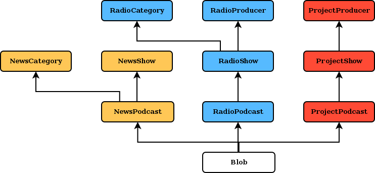

# Development setup

```
# Install python dependencies
pip install -r requirements.txt

# Install javascript dependencies
cd antxetamedia/static
bower install
cd ../..

# Setup the database
python manage.py migrate

# Start development server
python manage.py runserver
```

Additionally, if you want some sample data, you can get it by checking out the
`sample_data` branch and loading the `sample_data.json` json file into the
database:

```
python manage.py loaddata sample_data.json
```

# Running tests

```
python manage.py test
```

# General features

## Frontpage

- customized frontpage
- user selects favourite news categories and radio shows
- user selections stored as cookies

## Player

- single playlist per user
- playlist stored in local storage
- download entire playlist
- add, move and delete podcasts from playlist
- share podcasts
- integration with the radio stream

## Navigation

- news podcast searcher (per category, per producer)
- radio show searcher (per category, per producer)

## Integration with archive.org

- asynchronous uploads
- queue visualization system

### Test account

```
username: archive.org-test
password: archive.org-test
access key: VSh9SgRkxTYIaZUs
secret key: GsQjQ6KLtx63Sktr
```

## Other things

- licenses should be easy to see


# Architecture

## Layout



### News

Each podcast has a category and a producer.

### Radio

Each podcast has a show. Each show has a category and a producer.

### Projects

Each podcast has a project. Each project has a producer.

### Blobs

Each blob has a GFK to a podcast.

### Events

### Archives

### Schedule

### Flat pages

### Widgets

## Design decisions

### No nested categories

They do not use them currently.

- NewsShows do not need to be categorized.
- RadioShows can be categorized in RadioCategories and RadioProducers.
- ProjectShows can be categorized in ProjectProducers.

### No embeded multimedia models

If they want to use some external embed code, they can use the description text.

### Multiple audios per podcast

They use this feature nowadays. It's true that it makes it somewhat more
difficult to manage the playlist buttons but this can be solved by:

- making the add button add all the audios of the podcast to the playlist.
- making the play button play all the adios of the podcast.
- making the share button share the podcast link.

### Only RadioShows have the "featured" boolean

## User views

- frontpage
- frontpage configuration
- news
    - newspodcast_list: filtered by NewsShow and NewsCategory
    - newspodcast_detail
- radio
    - radioshow_list: filtered by RadioProducer and RadioCategory
    - radiopodcast_list
    - radiopodcast_detail
- projects
    - projectproducer_list
    - projectshow_detail
- archive
- events
    - event_list
    - event_detail
- schedule
    - broadcast_list
